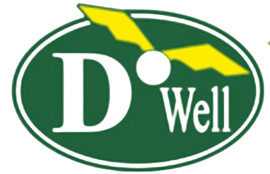

<a name="readme-top"></a>

<!-- PROJECT SHIELDS -->
<!--
*** I'm using markdown "reference style" links for readability.
*** Reference links are enclosed in brackets [ ] instead of parentheses ( ).
*** See the bottom of this document for the declaration of the reference variables
*** for contributors-url, forks-url, etc.
-->


<!-- PROJECT LOGO -->
<br />
<div align="center">
    

  <h3 align="center">DoWell NewsLetter</h3>

  <p align="center">
    Dowell NewsLetter Subscription App
    <br />
    <a href="https://dowell-newsletter-test.flutterflow.app/">View Published Web app</a>
  </p>
</div>


<!-- TABLE OF CONTENTS -->
<details>
  <summary>Table of Contents</summary>
  <ol>
    <li>
      <a href="#about-the-project">About The Project</a>
      <ul>
        <li><a href="#built-with">Built With</a></li>
      </ul>
    </li>
    <li>
      <a href="#getting-started">Getting Started</a>
      <ul>
        <li><a href="#prerequisites">Prerequisites</a></li>
        <li><a href="#installation">Installation</a></li>
      </ul>
    </li>
    <li><a href="#project">Go to the Project</a></li>
    <li><a href="#api_doc">Api Documetation</a></li>
    <li><a href="#acknowledgments">Acknowledgments</a></li>
  </ol>
</details>


<!-- ABOUT THE PROJECT -->
## About The Project

[![Product Name Screen Shot][product-screenshot]]
Dowell Newsletter Subscription App is an app that allows users to subscribe and unsubscribe to Dowell Newsletter channel. With its attractive user interface and good quality of user experience, you can easily stay updated with new information by subscribing to the newsletter.

Additionally, the app show the list of subscribed users to the newslatter. the app performance have been optimized which makes it fast and light.

<p align="right">(<a href="#readme-top">back to top</a>)</p>


### Built With

the application is build using flutterflow

* [![Flutter][Flutter]][Flutter-url]
* [![FlutterFlow][FlutterFlow]][FlutterFlow-url]
* [![Dart][Dart]][Dart-url]

<p align="right">(<a href="#readme-top">back to top</a>)</p>


<!-- GETTING STARTED -->
## Getting Started

when the source code is available the app can be installed and tested locally using the following steps.

### Prerequisites

Make sure flutter SDK is installed no the local machine

check flutter is running with no issues, usig the following command
```sh
  flutter doctor
```

### Installation

After the Environment is set, next donwload, get dependency and run the App

1. Clone the repo
   ```sh
   git clone https://github.com/DoWellLabs/Newsletter.git
   ```
2. Checkout the branch of the project
  ```sh
    git checkout branch_name
  ```
3. Install dependancy packages
   ```sh
   flutter pub get
   ```
4. connect a device and then run the app
   ```sh
   flutter run
   ```

<p align="right">(<a href="#readme-top">back to top</a>)</p>


## project

<p>To view published web <a href="https://dowell-newsletter-test.flutterflow.app/">link</a></p>

<p align="right">(<a href="#readme-top">back to top</a>)</p>


<!-- LICENSE -->
## License

Distributed under the apache License. See `LICENSE.txt` for more information.

<p align="right">(<a href="#readme-top">back to top</a>)</p>


<!-- CONTACT -->
## api_doc

the project is integrated with Dowell Newsletter Api

<p>the link for the Api documentation <a href="https://github.com/orgs/DoWellUXLab/">Dowell NewsLatter Api documentation</a></p>

<p align="right">(<a href="#readme-top">back to top</a>)</p>


<!-- MARKDOWN LINKS & IMAGES -->
[product-screenshot]: asset/images/project_screenshot.jpg
[Flutter]: https://img.shields.io/badge/Flutter-blue?style=for-the-badge&logo=flutter&logoColor=white
[Flutter-url]: https://flutter.dev/
[FlutterFlow]: https://img.shields.io/badge/FlutterFlow-black?style=for-the-badge&logo=Flutterflo&logoColor=4839e3
[FlutterFlow-url]:https://flutterflow.io/
[Dart]: https://img.shields.io/badge/dart-black?style=for-the-badge&logo=dart&logoColor=blue
[Dart-url]: https://dart.dev/